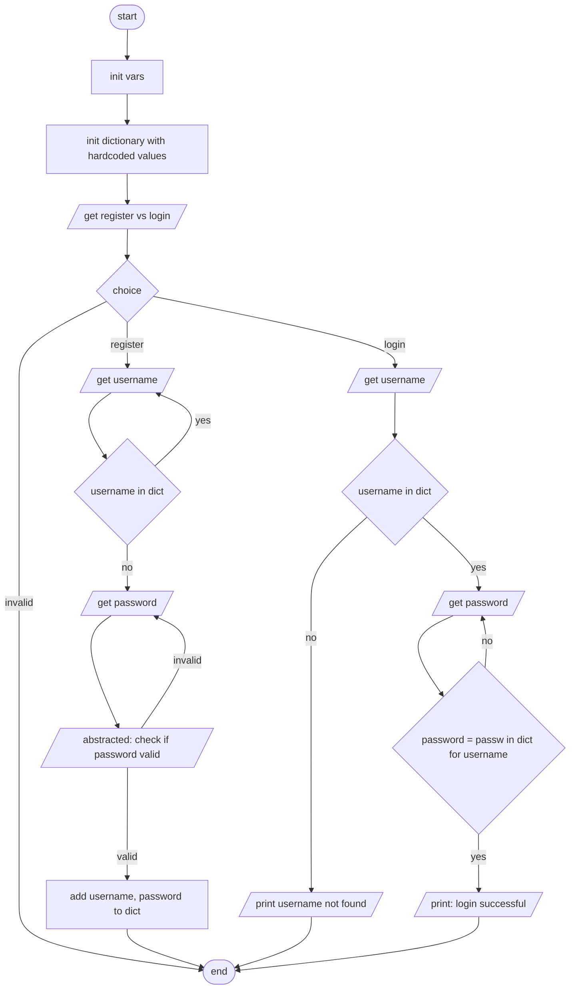

# Lab 3

Scott's SC1003 Lab 3 code explanation

## Pseudocode

1. Init vars for use in program
2. Init dictionary data (hardcoded key-value pairs)
3. Get user to choose to register or login
   1. if invalid choice, exit
   2. elif choice == register
      1. get user to input username
      2. if username in dictionary, print username exist err, repeat to 3.2.1
      3. get user to input password
      4. check password for conditions
         1. for letter in password, note if passes condition, mark condition as true
      5. if not all conditions are met, print password not strong enough err, repeat to 3.2.3
      6. add key-value pair of username and password to dictionary, using username as key.
      7. print current dictionary of users
      8. exit
   3. elif choice == login
      1. get user to input username
      2. if username not in dictionary, print username not exist err, exit
      3. get user to input password
      4. if value of key of username in dictionary is not equal to user_login_password, print password wrong, repeat to 3.3.3
      5. print user log in successful
      6. exit

## Flowchart

error viewing the diagram? [read it from source instead!](https://github.com/scottcjx/scotts-intro-to-comp/blob/main/lab_3/README.md)

## License
This project is available under the GPL v3 license. See the [LICENSE](./LICENSE.md) file for more info.

 
